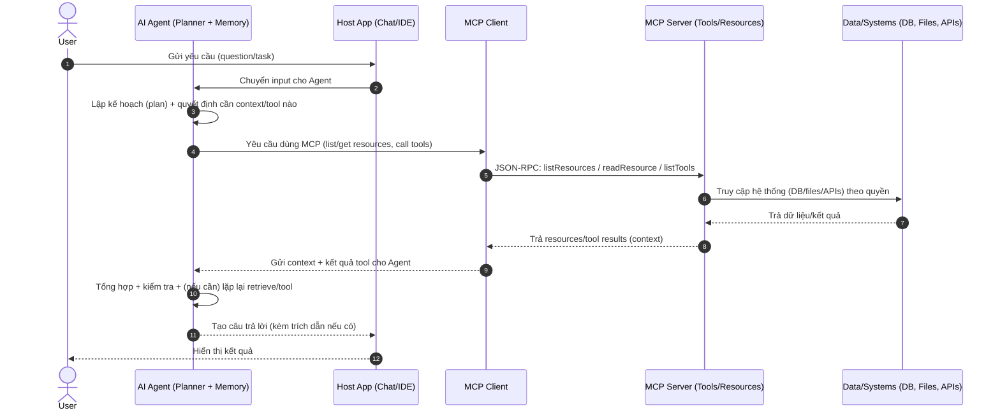

# Flow của AI Agent và MCP (Model Context Protocol)

> Tóm tắt: **Agent** là “bộ não điều phối” (plan → gọi tool → tổng hợp → trả lời).  
> **MCP** là “chuẩn cắm” để agent/host truy cập **tools/resources** (DB, files, internal APIs…) một cách chuẩn hoá.

---

## 1) AI agent làm gì khi nhận một câu hỏi?

Agent không chỉ “lên kế hoạch”, mà còn:
- **Điều phối trạng thái (state)**: theo dõi tiến trình, kết quả tool, các ràng buộc.
- **Quyết định gọi tool**: khi nào cần truy hồi (RAG), khi nào cần chạy hành động (API/DB), khi nào hỏi lại.
- **Quyết định dừng/tiếp tục**: lặp thêm retrieval/tool nếu context chưa đủ.
- **Áp guardrails**: kiểm soát quyền, an toàn, format đầu ra.

### Flow thường gặp (6 bước)
1. **Hiểu mục tiêu + phân loại yêu cầu**
   - Hỏi kiến thức chung? hỏi theo tài liệu nội bộ? cần tính toán? cần thao tác hệ thống?
   - Có cần trích dẫn không? có yêu cầu format (JSON/markdown) không?

2. **Chọn chiến lược trả lời**
   - Trả lời trực tiếp (nếu chắc và không cần dữ liệu ngoài)
   - RAG (cần tra tài liệu/KB)
   - Tool/Action (cần gọi API, DB, chạy code)
   - Hỏi lại người dùng (nếu thiếu thông tin quan trọng)

3. **Kiểm tra “đã có câu trả lời tương tự trước đó chưa?”**
   - **Conversation memory**: trong cuộc hội thoại hiện tại đã trả lời chưa?
   - **Long-term memory / Answer cache**: có Q/A tương tự trong kho trước đó không?
   - *Lưu ý*: cache giúp tối ưu hiệu năng và nhất quán, nhưng **không phải agent nào cũng bắt buộc** phải làm.

4. **Lập kế hoạch & chọn tool**
   - Tool nào cần gọi, thứ tự nào, gọi bao nhiêu lần (multi-hop).
   - Ví dụ: `rewrite_query -> vector_search -> rerank -> fetch_docs -> compose_answer`.

5. **Thực thi & vòng lặp**
   - Gọi tool (qua MCP hoặc integration trực tiếp).
   - Tự đánh giá: “context đủ chưa? có mâu thuẫn không? cần truy hồi thêm không?”
   - Nếu chưa đủ thì lặp lại (query khác, tăng k, đổi filter…).

6. **Sinh câu trả lời + kiểm soát**
   - Trả lời, kèm trích dẫn.
   - Nếu thiếu căn cứ: nói “không tìm thấy trong tài liệu”, hoặc đề xuất bước tiếp theo.

---

## 2) “Câu hỏi này đã có câu trả lời tương tự” nằm ở đâu?

Đây thường là một **policy/skill** trong agent, gồm:
- **Similarity check** (embedding search trong kho Q/A)
- **Cache layer** (key = normalized question + filters + user/role)
- **Validation**: nếu dữ liệu dễ thay đổi theo thời gian (giá, trạng thái hệ thống, chính sách…) thì nên re-check nguồn.

👉 Nên xem đây là **tối ưu hiệu năng + nhất quán**, không phải “bản chất bắt buộc” của agent.

---

## 3) MCP nằm ở đâu trong toàn bộ flow?

MCP giúp chuẩn hoá tầng **tool/data layer**:
- Agent muốn kiểm tra câu trả lời tương tự → gọi MCP tool: `search_answer_cache(query)`
- Agent muốn tra tài liệu → gọi MCP tool: `vector_search`, `get_document`, `get_citations`
- Agent muốn thao tác hệ thống → gọi MCP tool: `create_ticket`, `run_job`, `update_record`

**MCP không thay thế agent**: agent vẫn là nơi quyết định *gọi cái gì, gọi khi nào, gọi bao nhiêu lần, và dừng ở đâu*.

---

## 4) Sơ đồ sequence (flow theo thời gian)



---

## 5) Sơ đồ khối (nhìn tổng quan ai làm gì)

```mermaid
flowchart LR
  U[User] --> H[Host App\n(Chat UI / IDE)]
  H --> A[AI Agent\nPlanner • Memory • Guardrails]

  A -->|MCP requests\n(list/get resources, call tools)| C[MCP Client]
  C -->|JSON-RPC| S[MCP Server\nResources • Tools • Prompts]
  S --> D[(Data/Systems)\nDB • Files • Internal APIs]

  D --> S
  S --> C
  C -->|Context + Tool results| A

  A --> H --> U
```

---

## 6) Gợi ý 3 tool tối thiểu cho RAG (nếu áp vào hệ pgvector/FastAPI)

Nếu bạn muốn agent điều phối RAG “gọn” và hiệu quả, có thể chuẩn hoá thành 3 tool:
1. `search_embeddings(question, filters)`
2. `get_chunks(chunk_ids)`
3. `search_answer_cache(question)`

Agent thường chạy theo flow: **cache-check → retrieval → generate**, và bật vòng lặp khi retrieval kém.
